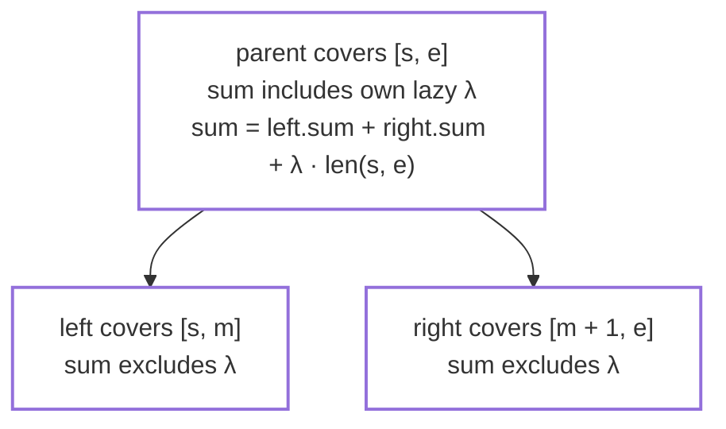
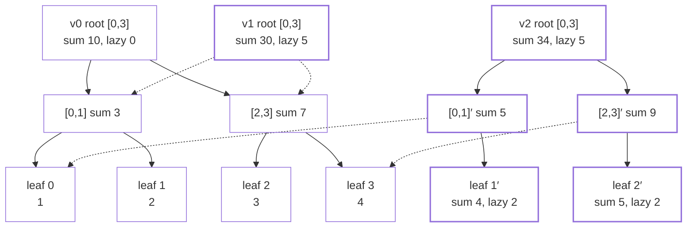
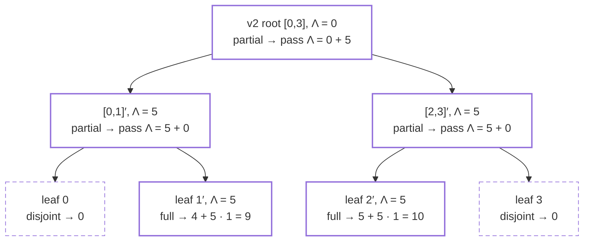
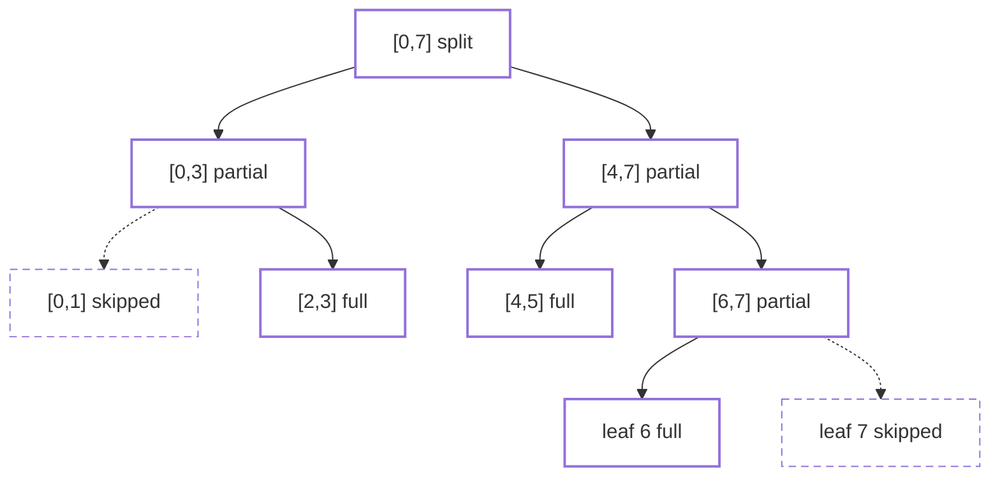

# Correctness and Complexity of the Persistent Lazy Segment Tree

This document proves that `valseg::PersistentLazySegmentTree` answers every historical range-sum
query correctly and preserves all published versions, and it establishes the time and space bounds
stated in the design contract
([Planned Versioned Tree](https://github.com/m-nobin/version-aware-lazy-segtree/wiki/Planned-Versioned-Tree)).
Completes [issue #9](https://github.com/m-nobin/version-aware-lazy-segtree/issues/9).

## 1. Preliminaries

Fix an initial array `A⁰ = (a₀, …, aₙ₋₁)` of `n` values from `ValueType`. The structure publishes a
sequence of versions `0, 1, …, V`, where version `0` represents `A⁰` and each later version is
produced by exactly one successful update. We write `Aᵛ` for the logical array of version `v`.

The two operations under proof are:

- `rangeAdd(l, r, δ)` — publishes version `V + 1` with
  `Aᵛ⁺¹[i] = Aᵛ[i] + δ` for `l ≤ i ≤ r` and `Aᵛ⁺¹[i] = Aᵛ[i]` otherwise, where `V` is the latest
  version;
- `rangeSum(v, l, r)` — returns `Σ_{i=l}^{r} Aᵛ[i]` for any published version `v`.

All values, intermediate products, and sums are assumed representable in `ValueType`; overflow is
outside the model, matching the contract.

## 2. Data-structure model

The structure owns an append-only arena `nodes` and a table `roots`, where `roots[v]` is the arena
index of version `v`'s root. Each node stores `(leftChild, rightChild, sum, lazy)` and covers a
segment `[s, e]` determined by its position; leaves use the sentinel child index. We write
`len(s, e) = e − s + 1`.

**Definition (represented value).** Let `x` be a node covering `[s, e]` and `i ∈ [s, e]`. The
value that `x` represents for `i`, written `valₓ(i)`, is the `sum` of the leaf of `i` below `x`
plus the `lazy` values of that leaf's proper ancestors up to and including `x` (a leaf's own
`lazy` is already inside its `sum`, by I2 below). If `x` is reached from a root through proper
ancestors with lazy values `λ₁, …, λₖ`, then the value of index `i` in that version is
`valₓ(i) + λ₁ + ⋯ + λₖ`.

## 3. Invariants

For every reachable node `x` covering `[s, e]` in every published version:

- **I1 (exact sum).** `x.sum = Σ_{i=s}^{e} valₓ(i)`: the sum of `x`'s segment in that version,
  excluding lazy values held by `x`'s proper ancestors.
- **I2 (self-inclusion).** `x.lazy` is included in `x.sum`.
- **I3 (child exclusion).** `x.lazy` is not included in either child's `sum`; for internal `x`,
  `x.sum = left.sum + right.sum + x.lazy · len(s, e)`.
- **I4 (immutability).** No node reachable from a published root is ever modified after its
  version is published.
- **I5 (root correctness).** For every published `v`, the tree rooted at `roots[v]` represents
  `Aᵛ` exactly.

The accounting rule of I2–I3 at a single internal node:

Every deferred contribution is therefore stored exactly once: either inside a node's own `sum` or
in an ancestor's `lazy` waiting to be inherited.

## 4. Lemmas

**Lemma 1 (build correctness).** After `initialize(A⁰)` with `n ≥ 1`, the tree rooted at
`roots[0]` satisfies I1–I3 with all lazy values zero and represents `A⁰`.

_Proof outline._ Induction on segment length: a leaf stores `aᵢ` with `lazy = 0`; an internal node
stores the sum of its children's sums with `lazy = 0`, so I1–I3 hold with every lazy term zero. ∎

**Lemma 2 (immutability, I4).** `update` and `query` never write to an existing arena element;
`update` only appends, and a failed update truncates the arena back to its pre-call checkpoint,
which removes only nodes appended by the failed call.

_Proof outline._ Inspection of the code paths: every modification is `nodes.push_back` of a new
element or `nodes.resize(checkpoint)` in the rollback handler; no reachable node is assigned. ∎

**Lemma 3 (update preserves the invariant).** Let `x'` be the node returned by
`update(x, s, e, l, r, δ)` where the old tree satisfies I1–I3. Then the tree rooted at `x'`
satisfies I1–I3 and represents the segment `[s, e]` of the updated array, while every node of the
old tree is unchanged and still shared where untouched.

_Proof outline._ Induction on the segment. Full coverage: the copy adds `δ · len(s, e)` to `sum`
and `δ` to `lazy`, so I2–I3 are preserved and I1 holds for the new array; children are shared
unchanged, which is sound because the added `δ` is excluded from them by I3. Partial coverage: the
copied parent keeps its own `lazy`, recomputes
`sum = left'.sum + right'.sum + lazy · len(s, e)` from the recursively updated children, and shares
any untouched child, so the invariant is reassembled exactly once per level. ∎

The design reference example illustrates the lemma. Version 1 (`rangeAdd(0, 3, 5)`, full coverage)
copies only the root; version 2 (`rangeAdd(1, 2, 2)`, partial) copies one path per side. Dotted
arrows are structural sharing into older versions; solid nodes are copies appended by an update:

No arrow ever points from an old node to a new one, which is the graph form of I4.

**Lemma 4 (query counts every lazy value exactly once).** For a tree satisfying I1–I3 and any
accumulator `Λ`, `query(x, s, e, l, r, Λ)` returns `Σ_{i ∈ [s,e] ∩ [l,r]} (valₓ(i) + Λ)`. In
particular, when `Λ` is the sum of the lazy values on the path strictly above `x`, the result is
the sum of the version's values over `[s, e] ∩ [l, r]`.

_Proof outline._ Induction on the segment. Disjoint segments contribute `0`. Full coverage returns
`x.sum + Λ · len(s, e)`, which by I1 is `Σ valₓ(i) + Λ · len(s, e)`: `x`'s own and descendant lazy
values are counted once inside `x.sum` (I2), each ancestor lazy value once through `Λ`. Partial
coverage recurses into both children with `Λ + x.lazy`, moving `x`'s lazy value from the node into
the inherited accumulator, and `valₓ(i) = val_child(i) + x.lazy`, so no contribution is dropped
or duplicated. ∎

Two implementation details keep the recursion well defined and read-only. The disjoint test runs
before the node is read, and a leaf (`s = e`) is either fully covered or disjoint, so the sentinel
child index of a leaf is never dereferenced; `update` likewise recurses into a child only when
that child's segment intersects `[l, r]`. `query` is a `const` member that reads `nodes` and
recurses — it allocates nothing and writes nothing, so its only memory is the `O(h)` call stack.

The descent for `rangeSum(v2, 1, 2)` on the example above shows the accumulator at work — the
root's deferred `5` reaches each selected leaf exactly once, and dashed nodes are pruned as
disjoint:

The returned value is `9 + 10 = 19`, matching the hand-traced expectation.

**Lemma 5 (isolation).** No operation changes the query result of any already-published version:
a successful update only appends nodes and one root entry (Lemma 2, Lemma 3), a zero-delta update
appends only a root entry that aliases the latest root, and a failed operation leaves `nodes`,
`roots`, `versionCount()`, and `nodeCount()` unchanged.

_Proof outline._ Combine Lemma 2 with the checkpoint rollback in `rangeAdd` and the
validate-before-allocate ordering: every throwing path executes before the first append or after
the rollback. ∎

## 5. Theorems

**Theorem 1 (historical query correctness).** For every published version `v` and valid range
`[l, r]`, `rangeSum(v, l, r) = Σ_{i=l}^{r} Aᵛ[i]`.

_Proof outline._ Lemma 1 gives I5 for version 0; Lemma 3 extends I5 to each later version by
induction over the update sequence; Lemma 5 shows later operations cannot invalidate it; Lemma 4
applied at `roots[v]` with `Λ = 0` yields the stated sum. ∎

**Theorem 2 (partial persistence).** Every successful `rangeAdd` publishes exactly one new
version derived from the latest version, all earlier versions remain queryable with unchanged
results, and unchanged subtrees are physically shared between versions.

_Proof outline._ `rangeAdd` appends exactly one entry to `roots`; sharing and preservation follow
from Lemmas 2, 3, and 5. ∎

## 6. Complexity analysis

Let `n` be the array size, `h = ⌈log₂ n⌉` the tree height, `U` the number of successful updates,
and `U₊ ≤ U` the number of those with a non-zero delta.

**Proposition 1 (update-frontier locality).** For every successful non-zero `rangeAdd`, each
invocation of `update` covers a segment that intersects `[l, r]`, appends exactly one copied node,
and causes no other append. Consequently no disjoint segment is copied, and the number of copied
nodes equals the number of `update` invocations.

_Proof outline._ `update` is entered at the root and re-entered only for a child whose segment
intersects `[l, r]` (the `queryLeft <= middle` / `queryRight > middle` guards). Both branches end
in exactly one `nodes.push_back`. ∎

**Proposition 2 (complexity).** The per-operation bounds below hold; update-side time bounds are
amortized because `nodes` and `roots` grow as `std::vector`s, query time is worst-case.

| Operation           |                 Time | Additional space                              |
| ------------------- | -------------------: | --------------------------------------------- |
| `initialize`        |               `O(n)` | `2n − 1` nodes                                |
| `rangeAdd`, `δ ≠ 0` | `O(log n)` amortized | `≤ 4(h + 1)` copied nodes                     |
| `rangeAdd`, `δ = 0` |     `O(1)` amortized | one root entry                                |
| `rangeSum`          |           `O(log n)` | none (call stack `O(h)`)                      |
| Total retained      |                    — | `O(n + U₊ log n)` nodes, `U + 1` root entries |

_Argument outline._

- **Build** touches each of the `2n − 1` nodes once; `initialize` reserves that many up front, so
  the build itself never reallocates.
- **Update** recursion visits at most four nodes per level (the standard segment-tree boundary
  argument: after the topmost level where the update range splits, at most two partially covered
  nodes remain per level, each of which may visit two children, one of them fully covered and
  terminating), giving at most `4(h + 1)` invocations across levels `0 … h`; by Proposition 1 that
  is also the number of appended nodes.
- **Zero-delta fast path** performs validation and a single `roots.push_back`.
- **Query** visits the same `O(log n)` frontier read-only and allocates nothing (Lemma 4).
- **Space** is the build cost plus the per-update copies, giving `O(n + U₊ log n)` arena nodes.
  Every successful update, including a zero-delta one, appends exactly one root entry, so `roots`
  holds `U + 1` entries.
- **Amortization** applies only to the update side: an individual `push_back` may trigger an
  `O(current size)` reallocation of the arena or root table, but the amortized cost per append is
  `O(1)`, and nothing else in `rangeAdd` allocates.

The visited frontier for `rangeAdd(2, 6, δ)` on `n = 8` — seven copies, never more than four
visited nodes on a level; dashed subtrees are skipped and shared unchanged:

The deterministic suite (`tests/persistent_lazy_segment_tree_test.cpp`) corroborates the node-copy
counts exactly through `nodeCount()`: one copied root per full-coverage update, `h + 1` copies per
single-leaf update on `n = 8`, and zero copies per zero-delta update. The randomized differential
suite (`tests/differential_validation_test.cpp`) additionally asserts the `4(h + 1)` bound of
Proposition 2 on every non-zero update it generates.

## 7. Scope and assumptions

- Updates apply to the latest version only; branching from historical versions is out of scope.
- The proof assumes `n ≥ 1`. `initialize` with an empty array publishes version 0 with no nodes and
  the sentinel as root; `rangeAdd` and `rangeSum` then reject every call, so no tree property is
  exercised.
- `initialize` replaces the entire history: I4 and Theorem 2 are statements about the versions
  published since the most recent `initialize`, not across re-initializations.
- Overflow of `ValueType` is excluded by contract; the large-value tests exercise the extremes the
  model admits. Segment lengths are computed in `ValueType`, which assumes `n` fits in it.
- Allocation failures are covered by Lemma 5 through the checkpoint rollback; no other failure
  modes exist in the operations under proof.
- The structure is not synchronized; concurrent use requires external serialization.

## 8. Appendix: baseline complexity

This appendix collects, in one place, the bounds already proved and `static_assert`ed in each
Phase 7 comparison baseline's own header. Nothing is re-derived here — each row is an index into
the header that owns the argument, and each baseline's deterministic suite asserts its retained
node count exactly. The purpose is to make the benchmark's expected shape legible before any
number is measured: the runner should confirm these bounds, not discover them.

`n` = array size, `h = ⌈log₂ n⌉`, `U` = successful updates, `U₊` = those with a non-zero delta,
`V` = published versions. All structures share one operation model: range-add on the latest
version, range-sum on any published version, identical validation order and exception types.

| Structure | Update, `δ ≠ 0` | Historical query | Retained nodes | Node bytes | Header |
| --- | ---: | ---: | ---: | ---: | --- |
| `PersistentLazySegmentTree` | `O(log n)`, `≤ 4(h + 1)` copies | `O(log n)` | `O(n + U₊ log n)` | 32 | `persistent_lazy_segment_tree.hpp` |
| `FullCopyPersistentSegmentTree` | `O(n)`, exactly `2n − 1` copies | `O(log n)` | exactly `(2n − 1)(U₊ + 1)` | 24 | `full_copy_persistent_segment_tree.hpp` |
| `PointOnlyPersistentSegmentTree` | `Θ(k + log n)` over `k` leaves | `O(log n)` | `O(n + Σkᵢ + U₊ log n)` | 24 | `point_only_persistent_segment_tree.hpp` |
| `CheckpointingSegmentTree` | `O(log n + n / K)` amortized | `O(log n + K)` | `(⌊U / K⌋ + 2)(2n − 1) + U` | 16 + 24/entry | `checkpointing_segment_tree.hpp` |
| `BufferedPathCopyingSegmentTree` | `O(log n)`, `0 … \|P\|` copies | `O(log n)` | `2n − 1 + Σcᵢ`, `O(n + U₊ log n)` | 88 | `buffered_path_copying_segment_tree.hpp` |
| `FatNodePersistentSegmentTree` | `O(log n)`, `0 … 4(h + 1)` copies | `O(log n · log K) = O(log n)` | exactly `2n − 1 + Σ_v ⌊m_v / K⌋` | 128 | `fat_node_persistent_segment_tree.hpp` |

Every structure shares the `O(1)` zero-delta path: a `δ = 0` update publishes a version that
reuses the latest root (or, for the checkpointing baseline, appends one log entry) and allocates
no tree node.

**`FullCopyPersistentSegmentTree`** materializes every version independently, so nothing is shared
and the retained-node identity is exact and closed-form. It bounds the design space from above:
whatever path copying and lazy tags save is measured against it.

**`PointOnlyPersistentSegmentTree`** keeps path copying and structural sharing but drops the lazy
tag, so an update must descend to every leaf in the range. It isolates the lazy tag's contribution
alone: identical machinery, one missing mechanism, `Θ(k + log n)` instead of `O(log n)`.

**`CheckpointingSegmentTree`** is the log-plus-snapshot strategy of the systems literature rather
than a persistence technique: one ephemeral tree, an append-only update log, and a full copy every
`K` versions. It is the only baseline whose *query* cost depends on which version is read, and the
only one with a tunable parameter, so it is the one that produces a curve rather than a point.
`K = 1` degenerates to the full-copy cost model; `K → ∞` replays the entire log.

**`BufferedPathCopyingSegmentTree`** gives each node a two-slot buffer of version-tagged value
modifications, so a visited node with a free slot absorbs its delta in place and appends nothing.
Only value deltas are buffered, never child indices, so a copied node forces its visited ancestors
to copy too. It is a design-space point between path copying and node copying, trading a
2.75× node against roughly a third of the copies on repeated point updates.

**`FatNodePersistentSegmentTree`** is the classical alternative to path copying (Driscoll, Sarnak,
Sleator and Tarjan, 1989): a fixed tree shape where each node carries a bounded, version-stamped
list of its full states, and node copying only on overflow. Because a reader binary-searches at
most `K` stamps rather than walking a successor chain, access cost is independent of `V` — the
property that separates a faithful fat node from the naive version-list implementation, and the
one the benchmark should confirm by holding update and query time flat as `V` grows.

The comparison the benchmark exists to make is therefore not "which is fastest" but which term
dominates where: copies per update (full-copy, point-only), bytes per node (buffered, fat node),
replay length per query (checkpointing), or the `U₊ log n` arena growth the proposed structure
pays. Section 6 gives the proposed structure's bounds; this appendix gives the field it is
measured against.
