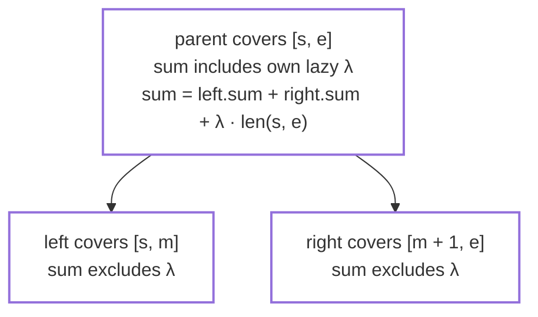
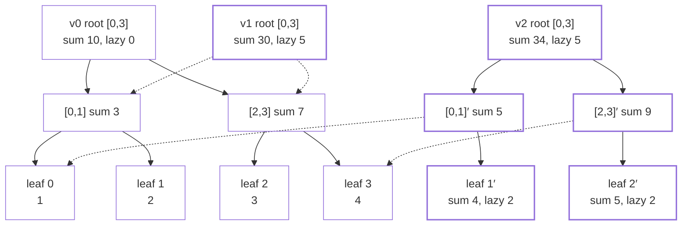
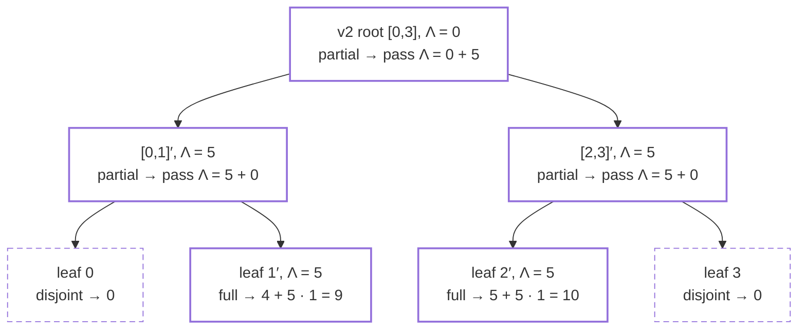
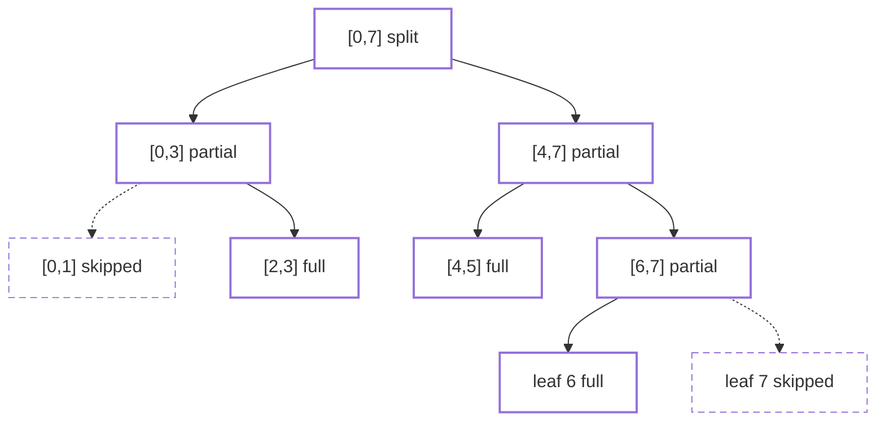
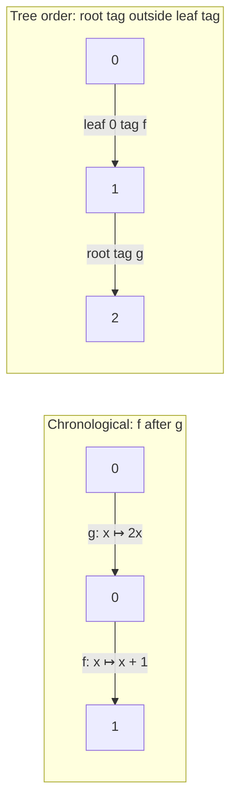

# Correctness and Complexity of the Persistent Lazy Segment Tree

This document proves that `valseg::PersistentLazySegmentTree` answers every historical range-sum
query correctly and preserves all published versions, and it establishes the time and space bounds
stated in the design contract
([Planned Versioned Tree](https://github.com/m-nobin/version-aware-lazy-segtree/wiki/Planned-Versioned-Tree)).
Completes [issue #9](https://github.com/m-nobin/version-aware-lazy-segtree/issues/9).

Sections 1 to 8 are the SumAdd proof and complexity analysis. Section 9 generalizes the
correctness argument to an arbitrary aggregate/action policy and characterizes when retaining tags
is correct at all; it is the theorem of the Route B programme's PR3 and is not cited as a result
until its review record (section 9.10) is complete.

## 1. Preliminaries

Fix an initial array `A⁰ = (a₀, …, aₙ₋₁)` of `n` values from `ValueType`. The structure publishes a
sequence of versions `0, 1, …, V`, where version `0` represents `A⁰` and each later version is
produced by exactly one successful update. We write `Aᵛ` for the logical array of version `v`.

The two operations under proof are:

- `rangeAdd(l, r, δ)` — publishes version `V + 1` with
  `Aᵛ⁺¹[i] = Aᵛ[i] + δ` for `l ≤ i ≤ r` and `Aᵛ⁺¹[i] = Aᵛ[i]` otherwise, where `V` is the latest
  version;
- `rangeSum(v, l, r)` — returns `Σ_{i=l}^{r} Aᵛ[i]` for any published version `v`.

All values, intermediate products, and sums are assumed representable in `ValueType`; overflow is
outside the model, matching the contract.

## 2. Data-structure model

The structure owns an append-only arena `nodes` and a table `roots`, where `roots[v]` is the arena
index of version `v`'s root. Each node stores `(leftChild, rightChild, sum, lazy)` and covers a
segment `[s, e]` determined by its position; leaves use the sentinel child index. We write
`len(s, e) = e − s + 1`.

**Definition (represented value).** Let `x` be a node covering `[s, e]` and `i ∈ [s, e]`. The
value that `x` represents for `i`, written `valₓ(i)`, is the `sum` of the leaf of `i` below `x`
plus the `lazy` values of that leaf's proper ancestors up to and including `x` (a leaf's own
`lazy` is already inside its `sum`, by I2 below). If `x` is reached from a root through proper
ancestors with lazy values `λ₁, …, λₖ`, then the value of index `i` in that version is
`valₓ(i) + λ₁ + ⋯ + λₖ`.

## 3. Invariants

For every reachable node `x` covering `[s, e]` in every published version:

- **I1 (exact sum).** `x.sum = Σ_{i=s}^{e} valₓ(i)`: the sum of `x`'s segment in that version,
  excluding lazy values held by `x`'s proper ancestors.
- **I2 (self-inclusion).** `x.lazy` is included in `x.sum`.
- **I3 (child exclusion).** `x.lazy` is not included in either child's `sum`; for internal `x`,
  `x.sum = left.sum + right.sum + x.lazy · len(s, e)`.
- **I4 (immutability).** No node reachable from a published root is ever modified after its
  version is published.
- **I5 (root correctness).** For every published `v`, the tree rooted at `roots[v]` represents
  `Aᵛ` exactly.

The accounting rule of I2–I3 at a single internal node:



Every deferred contribution is therefore stored exactly once: either inside a node's own `sum` or
in an ancestor's `lazy` waiting to be inherited.

## 4. Lemmas

**Lemma 1 (build correctness).** After `initialize(A⁰)` with `n ≥ 1`, the tree rooted at
`roots[0]` satisfies I1–I3 with all lazy values zero and represents `A⁰`.

_Proof outline._ Induction on segment length: a leaf stores `aᵢ` with `lazy = 0`; an internal node
stores the sum of its children's sums with `lazy = 0`, so I1–I3 hold with every lazy term zero. ∎

**Lemma 2 (immutability, I4).** `update` and `query` never write to an existing arena element;
`update` only appends, and a failed update truncates the arena back to its pre-call checkpoint,
which removes only nodes appended by the failed call.

_Proof outline._ Inspection of the code paths: every modification is `nodes.push_back` of a new
element or `nodes.resize(checkpoint)` in the rollback handler; no reachable node is assigned. ∎

**Lemma 3 (update preserves the invariant).** Let `x'` be the node returned by
`update(x, s, e, l, r, δ)` where the old tree satisfies I1–I3. Then the tree rooted at `x'`
satisfies I1–I3 and represents the segment `[s, e]` of the updated array, while every node of the
old tree is unchanged and still shared where untouched.

_Proof outline._ Induction on the segment. Full coverage: the copy adds `δ · len(s, e)` to `sum`
and `δ` to `lazy`, so I2–I3 are preserved and I1 holds for the new array; children are shared
unchanged, which is sound because the added `δ` is excluded from them by I3. Partial coverage: the
copied parent keeps its own `lazy`, recomputes
`sum = left'.sum + right'.sum + lazy · len(s, e)` from the recursively updated children, and shares
any untouched child, so the invariant is reassembled exactly once per level. ∎

The design reference example illustrates the lemma. Version 1 (`rangeAdd(0, 3, 5)`, full coverage)
copies only the root; version 2 (`rangeAdd(1, 2, 2)`, partial) copies one path per side. Dotted
arrows are structural sharing into older versions; solid nodes are copies appended by an update:



No arrow ever points from an old node to a new one, which is the graph form of I4.

**Lemma 4 (query counts every lazy value exactly once).** For a tree satisfying I1–I3 and any
accumulator `Λ`, `query(x, s, e, l, r, Λ)` returns `Σ_{i ∈ [s,e] ∩ [l,r]} (valₓ(i) + Λ)`. In
particular, when `Λ` is the sum of the lazy values on the path strictly above `x`, the result is
the sum of the version's values over `[s, e] ∩ [l, r]`.

_Proof outline._ Induction on the segment. Disjoint segments contribute `0`. Full coverage returns
`x.sum + Λ · len(s, e)`, which by I1 is `Σ valₓ(i) + Λ · len(s, e)`: `x`'s own and descendant lazy
values are counted once inside `x.sum` (I2), each ancestor lazy value once through `Λ`. Partial
coverage recurses into both children with `Λ + x.lazy`, moving `x`'s lazy value from the node into
the inherited accumulator, and `valₓ(i) = val_child(i) + x.lazy`, so no contribution is dropped
or duplicated. ∎

Two implementation details keep the recursion well defined and read-only. The disjoint test runs
before the node is read, and a leaf (`s = e`) is either fully covered or disjoint, so the sentinel
child index of a leaf is never dereferenced; `update` likewise recurses into a child only when
that child's segment intersects `[l, r]`. `query` is a `const` member that reads `nodes` and
recurses — it allocates nothing and writes nothing, so its only memory is the `O(h)` call stack.

The descent for `rangeSum(v2, 1, 2)` on the example above shows the accumulator at work — the
root's deferred `5` reaches each selected leaf exactly once, and dashed nodes are pruned as
disjoint:



The returned value is `9 + 10 = 19`, matching the hand-traced expectation.

**Lemma 5 (isolation).** No operation changes the query result of any already-published version:
a successful update only appends nodes and one root entry (Lemma 2, Lemma 3), a zero-delta update
appends only a root entry that aliases the latest root, and a failed operation leaves `nodes`,
`roots`, `versionCount()`, and `nodeCount()` unchanged.

_Proof outline._ Combine Lemma 2 with the checkpoint rollback in `rangeAdd` and the
validate-before-allocate ordering: every throwing path executes before the first append or after
the rollback. ∎

## 5. Theorems

**Theorem 1 (historical query correctness).** For every published version `v` and valid range
`[l, r]`, `rangeSum(v, l, r) = Σ_{i=l}^{r} Aᵛ[i]`.

_Proof outline._ Lemma 1 gives I5 for version 0; Lemma 3 extends I5 to each later version by
induction over the update sequence; Lemma 5 shows later operations cannot invalidate it; Lemma 4
applied at `roots[v]` with `Λ = 0` yields the stated sum. ∎

**Theorem 2 (partial persistence).** Every successful `rangeAdd` publishes exactly one new
version derived from the latest version, all earlier versions remain queryable with unchanged
results, and unchanged subtrees are physically shared between versions.

_Proof outline._ `rangeAdd` appends exactly one entry to `roots`; sharing and preservation follow
from Lemmas 2, 3, and 5. ∎

## 6. Complexity analysis

Let `n` be the array size, `h = ⌈log₂ n⌉` the tree height, `U` the number of successful updates,
and `U₊ ≤ U` the number of those with a non-zero delta.

**Proposition 1 (update-frontier locality).** For every successful non-zero `rangeAdd`, each
invocation of `update` covers a segment that intersects `[l, r]`, appends exactly one copied node,
and causes no other append. Consequently no disjoint segment is copied, and the number of copied
nodes equals the number of `update` invocations.

_Proof outline._ `update` is entered at the root and re-entered only for a child whose segment
intersects `[l, r]` (the `queryLeft <= middle` / `queryRight > middle` guards). Both branches end
in exactly one `nodes.push_back`. ∎

**Proposition 2 (complexity).** The per-operation bounds below hold; update-side time bounds are
amortized because `nodes` and `roots` grow as `std::vector`s, query time is worst-case.

| Operation           |                 Time | Additional space                              |
| ------------------- | -------------------: | --------------------------------------------- |
| `initialize`        |               `O(n)` | `2n − 1` nodes                                |
| `rangeAdd`, `δ ≠ 0` | `O(log n)` amortized | `≤ 4(h + 1)` copied nodes                     |
| `rangeAdd`, `δ = 0` |     `O(1)` amortized | one root entry                                |
| `rangeSum`          |           `O(log n)` | none (call stack `O(h)`)                      |
| Total retained      |                    — | `O(n + U₊ log n)` nodes, `U + 1` root entries |

_Argument outline._

- **Build** touches each of the `2n − 1` nodes once; `initialize` reserves that many up front, so
  the build itself never reallocates.
- **Update** recursion visits at most four nodes per level (the standard segment-tree boundary
  argument: after the topmost level where the update range splits, at most two partially covered
  nodes remain per level, each of which may visit two children, one of them fully covered and
  terminating), giving at most `4(h + 1)` invocations across levels `0 … h`; by Proposition 1 that
  is also the number of appended nodes.
- **Zero-delta fast path** performs validation and a single `roots.push_back`.
- **Query** visits the same `O(log n)` frontier read-only and allocates nothing (Lemma 4).
- **Space** is the build cost plus the per-update copies, giving `O(n + U₊ log n)` arena nodes.
  Every successful update, including a zero-delta one, appends exactly one root entry, so `roots`
  holds `U + 1` entries.
- **Amortization** applies only to the update side: an individual `push_back` may trigger an
  `O(current size)` reallocation of the arena or root table, but the amortized cost per append is
  `O(1)`, and nothing else in `rangeAdd` allocates.

The visited frontier for `rangeAdd(2, 6, δ)` on `n = 8` — seven copies, never more than four
visited nodes on a level; dashed subtrees are skipped and shared unchanged:



The deterministic suite (`tests/persistent_lazy_segment_tree_test.cpp`) corroborates the node-copy
counts exactly through `nodeCount()`: one copied root per full-coverage update, `h + 1` copies per
single-leaf update on `n = 8`, and zero copies per zero-delta update. The randomized differential
suite (`tests/differential_validation_test.cpp`) additionally asserts the `4(h + 1)` bound of
Proposition 2 on every non-zero update it generates.

## 7. Scope and assumptions

- Updates apply to the latest version only; branching from historical versions is out of scope.
- The proof assumes `n ≥ 1`. `initialize` with an empty array publishes version 0 with no nodes and
  the sentinel as root; `rangeAdd` and `rangeSum` then reject every call, so no tree property is
  exercised.
- `initialize` replaces the entire history: I4 and Theorem 2 are statements about the versions
  published since the most recent `initialize`, not across re-initializations.
- Overflow of `ValueType` is excluded by contract; the large-value tests exercise the extremes the
  model admits. Segment lengths are computed in `ValueType`, which assumes `n` fits in it.
- Allocation failures are covered by Lemma 5 through the checkpoint rollback; no other failure
  modes exist in the operations under proof.
- The structure is not synchronized; concurrent use requires external serialization.

## 8. Appendix: baseline complexity

This appendix collects, in one place, the bounds already proved and `static_assert`ed in each
Phase 7 comparison baseline's own header. Nothing is re-derived here — each row is an index into
the header that owns the argument, and each baseline's deterministic suite asserts its retained
node count exactly. The purpose is to make the benchmark's expected shape legible before any
number is measured: the runner should confirm these bounds, not discover them.

`n` = array size, `h = ⌈log₂ n⌉`, `U` = successful updates, `U₊` = those with a non-zero delta,
`V` = published versions. All structures share one operation model: range-add on the latest
version, range-sum on any published version, identical validation order and exception types.

| Structure | Update, `δ ≠ 0` | Historical query | Retained nodes | Node bytes | Header |
| --- | ---: | ---: | ---: | ---: | --- |
| `PersistentLazySegmentTree` | `O(log n)`, `≤ 4(h + 1)` copies | `O(log n)` | `O(n + U₊ log n)` | 32 | `persistent_lazy_segment_tree.hpp` |
| `FullCopyPersistentSegmentTree` | `O(n)`, exactly `2n − 1` copies | `O(log n)` | exactly `(2n − 1)(U₊ + 1)` | 24 | `full_copy_persistent_segment_tree.hpp` |
| `PointOnlyPersistentSegmentTree` | `Θ(k + log n)` over `k` leaves | `O(log n)` | `O(n + Σkᵢ + U₊ log n)` | 24 | `point_only_persistent_segment_tree.hpp` |
| `CheckpointingSegmentTree` | `O(log n + n / K)` amortized | `O(log n + K)` | `(⌊U / K⌋ + 2)(2n − 1) + U` | 16 + 24/entry | `checkpointing_segment_tree.hpp` |
| `BufferedPathCopyingSegmentTree` | `O(log n)`, `0 … \|P\|` copies | `O(log n)` | `2n − 1 + Σcᵢ`, `O(n + U₊ log n)` | 88 | `buffered_path_copying_segment_tree.hpp` |
| `FatNodePersistentSegmentTree` | `O(log n)`, `0 … 4(h + 1)` copies | `O(log n · log K) = O(log n)` | exactly `2n − 1 + Σ_v ⌊m_v / K⌋` | 128 | `fat_node_persistent_segment_tree.hpp` |

Every structure shares the `O(1)` zero-delta path: a `δ = 0` update publishes a version that
reuses the latest root (or, for the checkpointing baseline, appends one log entry) and allocates
no tree node.

**`FullCopyPersistentSegmentTree`** materializes every version independently, so nothing is shared
and the retained-node identity is exact and closed-form. It bounds the design space from above:
whatever path copying and lazy tags save is measured against it.

**`PointOnlyPersistentSegmentTree`** keeps path copying and structural sharing but drops the lazy
tag, so an update must descend to every leaf in the range. It isolates the lazy tag's contribution
alone: identical machinery, one missing mechanism, `Θ(k + log n)` instead of `O(log n)`.

**`CheckpointingSegmentTree`** is the log-plus-snapshot strategy of the systems literature rather
than a persistence technique: one ephemeral tree, an append-only update log, and a full copy every
`K` versions. It is the only baseline whose *query* cost depends on which version is read, and the
only one with a tunable parameter, so it is the one that produces a curve rather than a point.
`K = 1` degenerates to the full-copy cost model; `K → ∞` replays the entire log.

**`BufferedPathCopyingSegmentTree`** gives each node a two-slot buffer of version-tagged value
modifications, so a visited node with a free slot absorbs its delta in place and appends nothing.
Only value deltas are buffered, never child indices, so a copied node forces its visited ancestors
to copy too. It is a design-space point between path copying and node copying, trading a
2.75× node against roughly a third of the copies on repeated point updates.

**`FatNodePersistentSegmentTree`** is the classical alternative to path copying (Driscoll, Sarnak,
Sleator and Tarjan, 1989): a fixed tree shape where each node carries a bounded, version-stamped
list of its full states, and node copying only on overflow. Because a reader binary-searches at
most `K` stamps rather than walking a successor chain, access cost is independent of `V` — the
property that separates a faithful fat node from the naive version-list implementation, and the
one the benchmark should confirm by holding update and query time flat as `V` grows.

The comparison the benchmark exists to make is therefore not "which is fastest" but which term
dominates where: copies per update (full-copy, point-only), bytes per node (buffered, fat node),
replay length per query (checkpointing), or the `U₊ log n` arena growth the proposed structure
pays. Section 6 gives the proposed structure's bounds; this appendix gives the field it is
measured against.

## 9. Observational commutativity boundary

This section answers RQ1 of the research plan: which algebraic property makes retained,
outermost-first action accumulation correct. It is stated for the policy-generic templates in
`include/valseg/policy_trees.hpp`. On the tested seeded history the SumAdd instantiation of
`RetainedTagPersistentTree` agrees with `PersistentLazySegmentTree`, and the SumAdd instantiation of
`CopyOnPushPersistentTree` with `bench/copy_on_push_segment_tree.hpp`, in arena size after every
update and in every probed answer (`tests/policy_trees_test.cpp`, the two `ArenaAndAnswers` tests); the
templates differ from the SumAdd classes where the policy witness rejects an unrepresentable
result with `std::overflow_error`, and the bench ablation validates the version before
initialization where the template reports the missing version first. The update and query
recursions are the same code shape, so the statements below are read as statements about the
measured structures. The executable evidence for
each statement is indexed in section 9.9.

**Status.** Drafted for PR3. Nothing in this section is cited as a theorem in the manuscript until
the review record in section 9.10 is completed by a reader who did not implement the code.

### 9.1 Setting

A policy is `(S, A, combine, e, compose, id, apply)` satisfying the laws of
`docs/research/capability-taxonomy.md` section 2; `e` is `aggregateIdentity()`, `id` is
`actionIdentity()`, and `compose(g, f)` applies `f` first. Write `ρ_len(f)(x) = apply(f, x, len)`
for the transformation an action induces on aggregates of length `len`.

Fix the set `S₁⁰ ⊆ S` of admissible initial element values. The **reachable states** are

```text
R = { ρ₁(h_k) ∘ ⋯ ∘ ρ₁(h₁)(a) : a ∈ S₁⁰, k ≥ 0, h₁, …, h_k ∈ A }
```

and `R_len = { combine(x₁, …, x_len) : xᵢ ∈ R }` (any bracketing, by associativity) are the
reachable aggregates of length `len`, with `R₀ = { e }`. Because the operation model admits point
actions on any index from any initial array over `S₁⁰`, every tuple over `R` is the element array
of some segment in some reachable version, so `R_len` is exactly the set of valid aggregates of
length `len` that the policy laws are quantified over. Every aggregate a structure stores or
returns lies in some `R_len`, so the laws are only ever used on reachable states.

**Lemma 9.0 (closure).** `ρ_len(f)(R_len) ⊆ R_len` for every `f` and `len ≥ 1`, and
`apply(f, combine(x₁, …, x_len), len) = combine(ρ₁(f)(x₁), …, ρ₁(f)(x_len))`.

_Proof._ The distribution law `apply(f, combine(x, y), lenX + lenY) = combine(apply(f, x, lenX),
apply(f, y, lenY))`, applied `len − 1` times, and `apply(f, x, 1) = ρ₁(f)(x)`. ∎

A **history** is `H = (u₁, …, u_m)` with `u_j = (l_j, r_j, f_j)`, applied to `A⁰ ∈ (S₁⁰)ⁿ`. The
**chronological semantics** is the per-element array

```text
Aʲ[i] = ρ₁(f_j)(Aʲ⁻¹[i])   if l_j ≤ i ≤ r_j,    Aʲ[i] = Aʲ⁻¹[i]   otherwise,
```

and the chronological answer to a query is `Q(v, l, r) = combine(Aᵛ[l], …, Aᵛ[r])` folded in
index order. `tests/policy_oracle.hpp` (`ElementWiseOracle`) computes exactly this, so "agrees
with the oracle" below means "computes `Q`".

The canonical partition of `[0, n − 1]` is the one every structure in this repository builds:
node `[s, e]` splits at `⌊(s + e) / 2⌋`. For a range `[l, r]`, its **canonical decomposition**
`D(l, r)` is the set of canonical nodes at which the update recursion takes the full-coverage
branch: the maximal canonical intervals contained in `[l, r]`. They partition `[l, r]`, so each
`i ∈ [l, r]` lies in exactly one node of `D(l, r)`, and no node of `D(l, r)` is an ancestor of
another.

### 9.2 What the retained-tag tree computes

Let `D_j = D(l_j, r_j)`. For a version `v` and a canonical node `c`, the **placed tag** is the
chronological composition of the actions whose decomposition contains `c`:

```text
T_v(c) = compose(f_{j_k}, compose(…, compose(f_{j_2}, f_{j_1})))   for j₁ < ⋯ < j_k ≤ v, c ∈ D_{j_t},
T_v(c) = id                                                        if no such update exists.
```

**Lemma 9.1 (tag retention).** In `RetainedTagPersistentTree`, the record reachable from
`roots[v]` for canonical node `c` carries tag `T_v(c)`.

_Proof._ Induction over updates. The build stores `id` everywhere. For update `j` the recursion
visits exactly the canonical nodes whose interval meets `[l_j, r_j]`. At `c ∈ D_j` it appends a
copy with tag `compose(f_j, old tag)`, which is `T_j(c)` by definition. At a partially covered
node it appends a copy that keeps the old tag, and `c ∉ D_j`, so `T_j(c) = T_{j−1}(c)`. Every
other node is shared unchanged, and is likewise outside `D_j`. An update whose action is `id`
shares the latest root, and `compose(id, T) = T`. ∎

For an index `i` let `c₀, c₁, …, c_h` be its root-to-leaf path, `c₀` the root and `c_h` the leaf.
Define the **tree-order value** of `i` in version `v`, and its restriction below a node `x = c_d`:

```text
rep_v(i)   = ρ₁(T_v(c₀)) ∘ ρ₁(T_v(c₁)) ∘ ⋯ ∘ ρ₁(T_v(c_h)) (A⁰[i])
rep_v^x(i) = ρ₁(T_v(c_d)) ∘ ⋯ ∘ ρ₁(T_v(c_h)) (A⁰[i])
```

The leaf's tag is applied first and the root's last: deeper tags are inner, ancestor tags are
outer. This is the order the code applies them in, and it is independent of when the actions were
issued.

**Lemma 9.2 (tree-order semantics).** For every version `v` of `RetainedTagPersistentTree`:

- (a) every record `x` covering `[s, e]` satisfies `x.aggregate = combine(rep_v^x(s), …, rep_v^x(e))`;
- (b) `rangeAggregate(v, l, r) = combine(rep_v(l), …, rep_v(r))`.

Both hold for every valid policy, commuting or not: the lemma says what the structure computes,
not whether that is the intended answer.

_Proof._ (a) Induction over updates and, inside one update, over the recursion. After the build,
all tags are `id`, `ρ₁(id)` is the identity by the `apply(id, x, len) = x` law, leaves store
`A⁰[i]`, and internal aggregates are the combine of their children, which by associativity is the
index-order fold. Full coverage at `x`: the copy stores `apply(f, x.aggregate, len)`, which by
Lemma 9.0 is `combine(ρ₁(f)(rep^x(s)), …, ρ₁(f)(rep^x(e)))`; its tag is `compose(f, T(x))`, and
`ρ₁(compose(f, T(x))) = ρ₁(f) ∘ ρ₁(T(x))` by the composition law, so the new `rep^{x'}(i)` is
exactly `ρ₁(f)(rep^x(i))`, with the shared children and everything below them unchanged. Partial
coverage at `x`: the copy stores `apply(T(x), combine(left'.aggregate, right'.aggregate), len)`
with tag `T(x)`; by the induction hypothesis on the children and associativity the inner combine
is the fold of `rep^{child}(i)` over `[s, e]`, and Lemma 9.0 turns the outer `apply` into
`ρ₁(T(x))` on each element, which is `rep^{x'}(i)`.

(b) `rangeAggregate` calls `query(root, 0, n − 1, l, r, id)`. Let `Λ` at node `x = c_d` be the
inherited composition `compose(T(c₀), compose(T(c₁), …, T(c_{d−1})))`, outermost first, as the
descent builds it with `next = compose(inherited, x.tag)`. Claim:
`query(x, s, e, l, r, Λ) = combine over i ∈ [s, e] ∩ [l, r] of ρ₁(Λ)(rep^x(i))`, with the empty
fold equal to `e`. A disjoint segment returns `e`. A fully covered segment returns
`apply(Λ, x.aggregate, len)`, which by (a) and Lemma 9.0 is the claimed fold. A partially covered
segment combines the two children's results, computed with `compose(Λ, T(x))`, and
`ρ₁(compose(Λ, T(x))) = ρ₁(Λ) ∘ ρ₁(T(x))` moves this node's tag inside the accumulator exactly
once; the identity law for `combine` absorbs an empty side. At the root `Λ = id`. ∎

The reference model `TreeOrderModel` in `tests/policy_trees_test.cpp` is this definition executed
without aggregates or sharing; it is what the counterexample in section 9.5 is run against.

The retained-tag tree is **correct for `H`** if `rangeAggregate(v, l, r) = Q(v, l, r)` for every
`v ≤ m` and every `0 ≤ l ≤ r < n`.

### 9.3 Sufficiency

**Lemma 9.3 (length-one reduction).** If `ρ₁(f)` and `ρ₁(g)` commute on `R`, then `ρ_len(f)` and
`ρ_len(g)` commute on `R_len` for every `len ≥ 1`.

_Proof._ For `X = combine(x₁, …, x_len)`, Lemma 9.0 gives
`ρ_len(g)(ρ_len(f)(X)) = combine(ρ₁(g)(ρ₁(f)(x₁)), …)`, and swapping each pair on `R` gives the
other order. ∎

So the "for every length" wording of `kInducedActionsCommute` in `policy.hpp` and the length-one
condition below are the same condition under the policy laws.

**Theorem 9.4 (sufficiency).** If `ρ₁(f) ∘ ρ₁(g) = ρ₁(g) ∘ ρ₁(f)` on `R` for all `f, g ∈ A`, then
`RetainedTagPersistentTree` is correct for every history from every initial array over `S₁⁰`.

_Proof._ Fix `v` and `i`. By definition `rep_v(i)` is the product of `ρ₁(T_v(c_d))` over the path,
and by the composition law each `ρ₁(T_v(c_d))` is the product `ρ₁(f_{j_k}) ∘ ⋯ ∘ ρ₁(f_{j_1})` of
the actions placed on `c_d`. Since `i` lies in exactly one node of each `D_j`, `rep_v(i)` is a
product with one factor `ρ₁(f_j)` for each update `j ≤ v` covering `i`, in some order, applied to
`A⁰[i] ∈ R`. `Aᵛ[i]` is the same factors in chronological order. Any reordering is a sequence of
adjacent swaps; each swap is applied to a state in `R` (Lemma 9.0 at length one keeps every
prefix in `R`) and the hypothesis makes it an equality. So `rep_v(i) = Aᵛ[i]`, and Lemma 9.2(b)
gives `rangeAggregate(v, l, r) = combine(Aᵛ[l], …, Aᵛ[r]) = Q(v, l, r)`. ∎

### 9.4 Conditional necessity

**Theorem 9.5 (necessity).** Assume the operation model admits arrays of size `n ≥ 2` over any
initial values in `S₁⁰`, any action at any range, and single-element queries. If
`RetainedTagPersistentTree` is correct for every history, then `ρ₁(f)` and `ρ₁(g)` commute on `R`
for all `f, g ∈ A`.

_Proof._ Let `x ∈ R`, so `x = ρ₁(h_k) ∘ ⋯ ∘ ρ₁(h₁)(a)` with `a ∈ S₁⁰`, and let `f, g ∈ A`. Take
`n = 2`, `A⁰ = (a, b)` for any `b ∈ S₁⁰`, and the history

```text
h₁, …, h_k on [0, 0];   then g on [0, 1];   then f on [0, 0].
```

Let `v = k + 2`. By Lemma 9.1 the root carries `T_v(root) = g` and leaf 0 carries
`T_v(leaf 0) = compose(f, compose(h_k, …, h₁))`, so by Lemma 9.2
`rangeAggregate(v, 0, 0) = rep_v(0) = ρ₁(g)(ρ₁(f)(x))` (the single-element fold is the element,
by the identity law of `combine`). The chronological value is `Aᵛ[0] = ρ₁(f)(ρ₁(g)(x))`.
Correctness for this history equates them. For general `n ≥ 2` use `g` on `[0, n − 1]` and `f` on
`[0, 0]`; the intermediate nodes on leaf 0's path keep tag `id`. ∎

**What the assumptions do.**

- *Reachability.* The conclusion is about `R`, the states histories can produce, not all of `S`.
  A policy whose induced actions fail to commute only on unreachable states is still correct, and
  the theorem does not claim otherwise. This is why the boundary is observational.
- *Ancestor/descendant order.* The proof needs the pair `(g above, f below)` to be realizable:
  a full-range action followed by a point action does it for every `n ≥ 2`. Every `f` and `g` can
  be placed this way, so no restriction on `A` is needed beyond the operation model.
- *Order separation.* Correctness must be observable. A width-one query returns the element
  itself (the query combines `e` on whichever side the disjoint sibling lies, the oracle folds from
  `e` on the left, and both identity laws of `combine` make each equal to the element), so any
  difference between `ρ₁(g)ρ₁(f)(x)` and `ρ₁(f)ρ₁(g)(x)` is visible. If the
  interface only exposed wider aggregates, the theorem would additionally need `combine` to
  separate the two orders on some reachable neighbourhood; the plan's order-separation assumption
  is that condition, and the repository's operation model discharges it.

**Corollary 9.6 (boundary).** Under the assumptions of Theorem 9.5, `RetainedTagPersistentTree` is
correct for every history if and only if the induced transformations of the policy commute
pairwise on `R`. (Theorem 9.4 for one direction, Theorem 9.5 for the other.)

**Corollary 9.7 (faithful actions).** `ρ₁ : A → (R → R)` is a monoid homomorphism:
`ρ₁(compose(g, f)) = ρ₁(g) ∘ ρ₁(f)` and `ρ₁(id)` is the identity. If `ρ₁` is injective (the
action representation is **faithful** on `R`), then the induced transformations commute if and
only if `compose(f, g) = compose(g, f)` for all `f, g`: the boundary is syntactic commutativity of
the action monoid.

_Proof._ `ρ₁(f) ∘ ρ₁(g) = ρ₁(g) ∘ ρ₁(f)` is `ρ₁(compose(f, g)) = ρ₁(compose(g, f))`, and injectivity
lifts it to the actions. ∎

Instantiations:

- `SumAddPolicy` and `MinAddPolicy`: `ρ₁(d)(x) = x + d`, faithful whenever `R` is nonempty; the
  additive monoid commutes, so both are correct on the subject
  (`kInducedActionsCommute = true`, and the seeded oracle tests).
- `AffineSumModPolicy<p>` with `p` prime and `R` nonempty: `R` is closed under every shift
  `x ↦ x + b`, so `R = Z_p`; two maps `ax + b` that agree on two distinct residues agree as pairs,
  so the representation is faithful, and
  `compose((2, 0), (1, 1)) = (2, 2) ≠ (2, 1) = compose((1, 1), (2, 0))`. The subject is
  therefore incorrect for it, and section 9.5 exhibits the history.
- Without faithfulness the syntactic direction fails: give the additive action an extra field that
  `apply` ignores and `compose` concatenates. The monoid is syntactically noncommutative, the
  induced transformations commute, and the subject is correct. The paper therefore claims the
  observational statement, not that syntactic commutativity is necessary.

### 9.5 Minimal counterexample

`n = 2`, `AffineSumModPolicy<13>`, `A⁰ = (0, 0)`, `g = (2, 0)` (double) on `[0, 1]`, then
`f = (1, 1)` (increment) on `[0, 0]`.



Version 1 copies the root with tag `(2, 0)` and aggregate `0`. Version 2 descends past the root,
which keeps its tag, and copies leaf 0 with aggregate `apply((1, 1), 0, 1) = 1` and tag `(1, 1)`.
The query `rangeAggregate(2, 0, 0)` reaches leaf 0 with `Λ = (2, 0)` and returns
`apply((2, 0), 1, 1) = 2`; the chronological answer is `1`. The same history on
`CopyOnPushPersistentTree` pushes the root's `(2, 0)` into two copied leaves before touching leaf
0, so leaf 0 ends with aggregate `1` and tag `compose((1, 1), (2, 0)) = (2, 1)`, and the query
returns `1`; the second update appends four records where the subject appends two (the first
appends one in both). This is the trace of
`capability-taxonomy.md` section 2.2 at its smallest size, and the pair of actions is the one
`tests/policy_test.cpp` (`AffineSumDoesNotCommute`) checks at the policy level. The trace is also
executed on `RetainedTagPersistentTree` itself, instantiated with a test-local policy that inherits
`AffineSumModPolicy<13>` and falsifies `kInducedActionsCommute`
(`RetainedTagSubjectComputesTheTreeOrderOnTheWitnessTrace`): the arena grows `3 → 4 → 6` and the
query returns `2`, the tree-order value. That test checks Lemma 9.2 on the code; it is not
correctness evidence for anything.

### 9.6 Order-preserving strategies

**Theorem 9.8.** For every valid policy, `CopyOnPushPersistentTree`,
`PointMaterializedPersistentTree` and `PushedLazyTree` compute `Q` (the last for the latest
version only).

_Proof._ *Point materialization.* There are no tags. An update replaces the aggregate of every
leaf in its range by `ρ₁(f_j)` of the old one and recomputes each copied internal node as the
combine of its children, so leaf aggregates are `Aᵛ[i]` by induction and a query folds them in
index order.

*Pushing.* Both remaining structures keep the node convention of Lemma 9.2, so
`rep_v(i)`, the product of the tags on `i`'s path applied leaf first, is defined the same way
(for `PushedLazyTree`, whose aggregate excludes its own pending tag, read "aggregate after
`push`"). A push moves a tag `t` from node `x` into its children: `child.tag :=
compose(t, child.tag)`, `child.aggregate := apply(t, child.aggregate, len_child)`,
`x.tag := id`. `PushedLazyTree` pushes into a leaf by absorbing `t` into the leaf aggregate
instead of the leaf tag, so for that structure the leaf aggregate carries a prefix of the
element's actions. It preserves `rep` for every element below `x` (`ρ₁(compose(t, T)) = ρ₁(t) ∘ ρ₁(T)`)
and preserves Lemma 9.2(a) at `x` (`combine(apply(t, L), apply(t, R)) = apply(t, combine(L, R))`),
so pushing changes what is stored but not what is represented.

Invariant **(C)**: track, for every stored tag, the formal word of actions that were composed
into it (the stored tag is that word's fold, and the composition law gives
`ρ₁(fold) = product`), and for every leaf the word of actions absorbed into its aggregate
(empty for `CopyOnPushPersistentTree`, whose `pushInto` composes into the leaf tag). For every
index `i`, the word absorbed into `i`'s leaf, followed by the words on `i`'s path from the leaf
outward, each read from inner to outer, is exactly the sequence of updates covering `i` in
chronological order. It holds after the build (no actions). A push preserves it: the moved `t` sat directly
outside the child's actions and still does, whether it lands in the child's tag or, for a leaf of
`PushedLazyTree`, at the end of the absorbed word. During update `j`, both structures push at every
partially covered node whose tag is not `id` before descending, so when the recursion reaches a node `x ∈ D_j` every proper
ancestor of `x` on the current path carries `id`; composing `f_j` outside `x`'s tag then places
`f_j` outermost on the path of every `i` below `x`, and `f_j` is the newest update. Elements not
below any node of `D_j` are not covered by `u_j` and their paths are only pushed. Hence (C) holds
in every version, so `rep_v(i) = Aᵛ[i]`.

`CopyOnPushPersistentTree` uses the query of Lemma 9.2(b) unchanged, so it returns `Q`.
`PushedLazyTree` pushes on entry and returns the aggregate at a fully covered node, which then
includes its tag, and combines in index order; the same fold gives `Q`. ∎

The pushing case is textbook lazy propagation; the AtCoder Library documents the same laws with
no commutativity requirement (claim matrix, section 2). Copy-on-push adds path copying and nothing
else, so the four records in section 9.5 are the price of order preservation; the frontier PR of
the research programme (claim C3 in `docs/research/claim-evidence-matrix.md`) is to quantify it
as the push frontier `P`.

### 9.7 Strategy-specific audit of the SumAdd baselines

The remaining persistent baselines are SumAdd-only and were not generalized. Their action class
follows from which of the two mechanisms above they implement, read from source at this commit.

| Structure | Source evidence | Mechanism | Action class |
| --- | --- | --- | --- |
| `FullCopyPersistentSegmentTree` | `src/full_copy_persistent_segment_tree.cpp`: nodes hold two children and a sum, no tag; every nonzero update copies all `2n − 1` nodes and adds the delta at the leaves inside the range | point materialization with a complete copy | any valid policy (Theorem 9.8) |
| `BufferedPathCopyingSegmentTree` | `src/buffered_path_copying_segment_tree.cpp`, `update`: full coverage calls `modify(node, version, value * length, value)`, composing the delta into the node's version-stamped `lazy`; partial coverage leaves the node's `lazy` untouched or copies it with `latest.lazy`; `query` reads `snapshotAt(current, version)` and accumulates `inheritedLazy + state.lazy` outermost first | retained tags, read through the version filter | same as the subject for the state-storing form of the buffer (entries carrying an aggregate and a tag, as the fat node's `Modification` does): correct iff the induced actions commute (Theorems 9.4, 9.5). The implemented entries store additive deltas (`deltaSum = value * overlap`), a SumAdd refinement that MinAdd does not admit even though its actions commute. |
| `FatNodePersistentSegmentTree` | `src/fat_node_persistent_segment_tree.cpp`, `update`: full coverage does `next.lazy += value`; partial coverage recomputes `left + right + next.lazy * length` with `next.lazy` retained; `query` accumulates `inheritedLazy + current.lazy` | retained tags, stored as version-stamped node states | same as the subject |
| `CheckpointingSegmentTree` | `capability-taxonomy.md` section 5 | log projection by overlap length | SumAdd and separately proved query-projectable policies only; outside this section |

The buffered and fat-node placements satisfy Lemma 9.1 with the tag read at version `v`, so their
represented values are the tree-order values of Lemma 9.2 and the two theorems transfer without
new proof. No generic version of these structures is claimed or provided.

### 9.8 Copy safety

**Corollary 9.9 (copy safety, prior work).** `RetainedTagPersistentTree`,
`CopyOnPushPersistentTree` and `PointMaterializedPersistentTree` never write to a record
reachable from a published root: an update only
appends records and one root handle, and a failed update erases the records it appended
(`detail::rollBack`) before rethrowing. Historical results are therefore unchanged by later
operations. This is Lemma 2 and Lemma 5 restated for the templates, and it is path copying as in
Sarnak and Tarjan (1986); nothing in this section changes or improves the persistence mechanism.
The contribution of section 9 is the order analysis of what path copying computes when the copied
node keeps its tag.

### 9.9 Theorem-to-test map

| Statement | Executable evidence (`tests/`) |
| --- | --- |
| Templates agree with the measured structures in arena size after every update and in every probed answer on the tested history | `policy_trees_test.cpp`: `RetainedTagSumAddMatchesPersistentLazySegmentTreeArenaAndAnswers`, `CopyOnPushSumAddMatchesBenchAblationArenaAndAnswers` |
| Policy laws on tested domains | `policy_test.cpp`: `PolicyLaws.*` |
| Theorem 9.4, reordering step on the reference model | `policy_trees_test.cpp`: `TreeOrderEqualsChronologicalOrderForCommutingPolicies` |
| Theorem 9.4 on SumAdd and MinAdd | `policy_trees_test.cpp`: `PersistentPolicyTreeTest/SumAddRetainedTag`, `MinAddRetainedTag`; `RetainedTagMinAddHandTrace` |
| Theorem 9.5, section 9.5 witness | `policy_trees_test.cpp`: `AffineSumMinimalTraceSeparatesTreeOrderFromChronology` (reference model), `RetainedTagSubjectComputesTheTreeOrderOnTheWitnessTrace` (the subject with a falsified capability fact; Lemma 9.2 on the code, not correctness evidence); `policy_test.cpp`: `AffineSumDoesNotCommute` |
| Rejection of a policy that does not declare `kInducedActionsCommute` | `compile_fail/retained_tag_rejects_affine.cpp`, CTest `retained_tag_rejects_affine_compile_fail` |
| Theorem 9.8 on the witness and on seeded AffineSum histories | `policy_trees_test.cpp`: `ArbitraryActionControlsReturnTheChronologicalAnswerOnTheWitnessTrace`, `PersistentPolicyTreeTest/AffineSumCopyOnPush`, `AffineSumPointMaterialized`, `PushedLazyTreeAgreesWithOracleForEveryPolicy` |
| Corollary 9.9 for the templates | `policy_trees_test.cpp`: `FailedUpdatesPublishNothing`, `GenericTypesKeepTheSharedValidationContract`; historical isolation through the random-version probes of `PersistentPolicyTreeTest/*` |

Tests validate these implementations on the tested domains and seeds. The theorems are the
argument; the tests are the check that the argument is about the code that runs.

### 9.10 Review record

To be completed by a reader who did not implement `policy_trees.hpp` or this section. A
repository author may prepare the record but may not self-attest it.

Adversarial pre-review, 30 August 2026, by an automated reviewer that did not write the code or
this section: no blocking finding; three should-fix items (execute the witness trace on the subject
itself, correct the full-copy source description, replace "record for record" by the agreement
actually tested) and ten wording or precision items, all applied in this revision. This pre-review
does not satisfy the independence requirement below.

| Field | Review record |
| --- | --- |
| Reviewer name | Independent automated reviewer acting for Sunjare Zulfiker, at the repository owner's request |
| Independence basis | Did not write the code or this section; worked from the sources in a separate context; rebuilt and ran the policy and compile-fail tests (30 of 30 pass) |
| Material reviewed | Section 9, `include/valseg/policy.hpp`, `include/valseg/policy_trees.hpp`, `tests/policy_trees_test.cpp`, `tests/policy_oracle.hpp`, `tests/compile_fail/`, the three audited baseline sources, the capability taxonomy, the C2 row of the claim matrix and the README |
| Checked line by line | Quantifiers of Lemmas 9.0 to 9.3, Theorems 9.4, 9.5 and 9.8, Corollaries 9.6, 9.7 and 9.9; the `compose(newer, older)` direction in the lemmas and in `update`, `query`, `pushInto` and `push`; the reachability set `R`; the three named assumptions of section 9.4; the witness arithmetic of section 9.5 (arena `3 → 4 → 6`, copy-on-push `4 → 8`, answers 2 and 1, `compose((2,0),(1,1)) = (2,2) ≠ (2,1)`); the MinAdd hand trace; the theorem-to-test map |
| Decision | Approve with changes. The boundary statement (correct iff the induced actions commute on reachable states, under the stated operation model) is supported by the code and the tests. |
| Required changes and disposition | Four required: restate invariant (C) so the leaf-absorbing push of `PushedLazyTree` preserves it; relabel the `TreeOrderEqualsChronologicalOrderForCommutingPolicies` row as Theorem 9.4 evidence; replace "refuses a policy whose induced actions do not commute" with the declared-fact wording; mark the buffered baseline's additive-delta buffer as a SumAdd refinement whose action-class claim is for the state-storing form. Six precision items (nonzero updates in the full-copy row, "probed answer" wording and test names, the point-materialized tree in Corollary 9.9 and the isolation probes in the map, tense of the push-frontier reference, the bench ablation's pre-initialization validation order, the taxonomy trace wording). All ten applied in this revision. |
| Date | 30 August 2026 |
